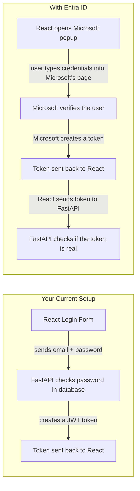

# Entra ID Deep Dive — Everything You Need to Know Before Implementing

---

## 1. What Is Entra ID?

**Microsoft Entra ID** (formerly Azure Active Directory) is Microsoft's login system for applications.

Your company uses it to manage:
- **Who exists** — all employees have accounts (shiven@company.com, manager@company.com)
- **Who can log in to what** — shiven can access Data Drive, but not the Finance app
- **What role they have** — shiven is a "User", manager is an "Admin"
- **Single Sign-On** — log in once to Teams, and you're automatically logged into every other company app

Think of it as a **centralized login server** that your company controls. Instead of every app having its own signup/login, they all point to one place: Entra ID.

---

## 2. What You Have Now vs. What Entra ID Does



| What | Now (Your Custom Auth) | With Entra ID |
|---|---|---|
| Where users type their password | Your login form | Microsoft's login page |
| Who checks the password | Your FastAPI + database | Microsoft |
| Who creates the JWT token | Your FastAPI (`python-jose`) | Microsoft |
| Who stores passwords | You (hashed in PostgreSQL) | Microsoft (you store nothing) |
| MFA (two-factor auth) | Not supported | Built-in, automatic |
| SSO | Not supported | Built-in |

---

## 3. The Key Terms — Plain English

### Tenant = Your Company's Account

A **tenant** is your organization's private space inside Entra ID. It contains all your company's users, groups, and registered apps.

```
Your company's tenant
├── Users
│   ├── shiven@company.com
│   ├── manager@company.com
│   └── intern2@company.com
├── Groups
│   ├── "Engineering"
│   └── "Managers"
└── Registered Apps
    ├── Data Drive (your app)
    ├── Company HR Portal
    └── etc.
```

Every tenant has a unique **Tenant ID** (just a long ID like `def456-xxxx-xxxx-xxxx`). When a user logs in, Microsoft uses the tenant ID to know which company's directory to check.

If you're using your **free student account**, you have your own personal tenant with just you as the only user. That's perfectly fine for building a POC.

### Client = Your App

A **client** is just any app that asks Entra ID for tokens. When you "register" an app, it gets a **Client ID** — a unique identifier.

You'll register **two clients**:
- **Frontend (React)** — "I want to log users in"
- **Backend (FastAPI)** — "I want to verify the tokens are real and meant for me"

### MSAL = The Login SDK

**MSAL (Microsoft Authentication Library)** is the npm package you install in your React app to handle the login flow.

Without MSAL, you'd have to manually:
1. Build the Microsoft login URL with a dozen parameters
2. Redirect the user to Microsoft
3. Handle the callback when they come back
4. Exchange a temporary code for actual tokens
5. Cache the tokens in the browser
6. Refresh tokens before they expire
7. Handle edge cases (multiple accounts, expired sessions, etc.)

**MSAL does all of this for you.** Your code becomes:

```javascript
import { useMsal } from "@azure/msal-react";

const { instance } = useMsal();

// One line to log in
const response = await instance.loginPopup({ scopes: ["api://your-api/access"] });

// response.accessToken ← send this to your FastAPI
```

Two npm packages:
- `@azure/msal-browser` — the core engine that handles OAuth
- `@azure/msal-react` — React-friendly wrapper (gives you hooks like `useMsal()`)

---

## 4. Why Register the Backend Too?

Your frontend is registered so it can redirect users to Microsoft's login page. But **why does the backend also need to be registered?**

Because of the **"TO:" field** in the token.

When Microsoft creates a token, it includes an audience (`aud`) field — like a "TO:" address on a letter:

```json
{
  "aud": "your-backend-client-id",    ← "This token is FOR this specific API"
  "email": "shiven@company.com",
  "name": "Shiven",
  "roles": ["User"]
}
```

Your FastAPI checks: *"Is this token addressed to ME?"* If the `aud` field doesn't match its own Client ID, it rejects the token.

Without registering the backend, there's no Client ID to put in the `aud` field, and any random token could be sent to your API.

**Think of it as:**
- Registering the frontend = "This app is allowed to REQUEST tokens"
- Registering the backend = "This API is the DESTINATION for those tokens"

---

## 5. Do All Services Need to Be Registered?

**Your question:** "If my frontend wants to talk to another service, does that service also need to be registered?"

**Answer: Only YOUR custom APIs need to be registered by you.**

- ✅ Your FastAPI backend → **You register it** (you create the app registration)
- ✅ Microsoft's own services (like Microsoft Graph for reading user profiles) → **Already registered by Microsoft**, you just request permission to use them
- ✅ A third-party SaaS app (Slack, Salesforce, etc.) → **Already registered by that company**, your IT admin just approves access
- ✅ Another custom API your team builds → **Yes, you'd register it** just like you register your FastAPI

So the rule is simple: **if you built it, you register it. If someone else built it, it's probably already registered.**

---

## 6. How Tokens Get Verified — Explained Simply

This replaces your current `python-jose` + `bcrypt` password checking.

### The Problem

Your React app sends a token to your FastAPI. FastAPI needs to know:

> **"Did Microsoft ACTUALLY create this token? Or did someone make up a fake one?"**

### The Solution: Signatures (Like a Wax Seal)

Imagine a king sends you a letter. How do you know it's really from the king?

**The king stamps it with his wax seal.** Only the king has that stamp. You can look at the seal and compare it to the king's known seal pattern.

That's exactly what happens with tokens:

```
Microsoft has two keys (just very long secret numbers):

 🔒 PRIVATE KEY (the wax seal stamp)
    → Only Microsoft has this
    → They "stamp" every token they create with it
    → Nobody else can create this stamp

 🔓 PUBLIC KEY (a photo of what the stamp looks like)
    → Microsoft publishes this at a public URL for anyone to download
    → Your FastAPI downloads it
    → Your FastAPI uses it to CHECK if the stamp is genuine
```

### What Happens Step by Step

```
1. User clicks "Sign in with Microsoft" in your React app
2. Microsoft popup opens → user types their email + password
3. Microsoft verifies the credentials → creates a token (JWT)
4. Microsoft STAMPS the token with their private key (digital signature)
5. Token goes back to your React app

6. React sends the token to your FastAPI:
   GET /data
   Authorization: Bearer eyJhbGci...(long encoded string)

7. FastAPI receives the token and thinks: "Is this real?"
8. FastAPI goes to a public Microsoft URL and downloads Microsoft's public key
   (This URL is called the "JWKS endpoint" — it's just a webpage
    where Microsoft posts "here's what our stamp looks like")
9. FastAPI checks: does the stamp on this token match the public key?
   → YES → "This is a genuine Microsoft token" ✅ → allow access
   → NO  → "This is fake" ❌ → reject

10. FastAPI also checks:
    → Is the token expired? (tokens have a time limit)
    → Is the "TO:" field (audience) my Client ID? (is it meant for ME?)
    → Is the issuer actually Microsoft? (not some random server pretending)
```

### Why Can't Someone Fake a Token?

You'd need Microsoft's **private key** to create a valid stamp, and that key is locked inside Microsoft's servers. The public key can *verify* stamps, but it **cannot create** them.

### The Good News: You Don't Code Any of This

The library `fastapi-azure-auth` does steps 7–10 automatically. You just write:

```python
@router.get("/protected-data")
async def get_data(user=Depends(azure_scheme)):
    # If we get here, the token is verified ✅
    # user.claims has the user's email, name, roles, etc.
    return {"hello": user.claims.get("name")}
```

---

## 7. Cost on Your Free Student Account

**$0. Completely free.**

| What | Cost |
|---|---|
| Entra ID Free tier | **$0** — included with every Azure account |
| Registering apps | **$0** — unlimited, no charge |
| User logins & tokens | **$0** — free tier supports up to 50,000 users/month |
| MSAL (npm package) | **$0** — open source |
| fastapi-azure-auth (pip package) | **$0** — open source |

Entra ID has paid tiers (P1 at ~$6/user/month, P2 at ~$9/user/month) for enterprise features like Conditional Access policies and identity governance. **You don't need any of those.** The free tier has everything for your POC.

---

## 8. What You Need From Your Manager

For building the POC, you need **one of these two options:**

### Option A: Use Your Own Student Account (no manager needed)
- You already have a free student Azure account
- It comes with its own Entra ID tenant
- You can register apps, create scopes, and test login — all by yourself
- **Limitation:** Only you can log in (it's your personal tenant)

### Option B: Use Your Company's Entra ID (need manager approval)
- Your manager gives you access to the company's **Entra admin center** ([entra.microsoft.com](https://entra.microsoft.com))
- You register your app there
- **Benefit:** All company employees can log in with their work accounts

### Recommended Approach

1. **Start with Option A** — build the POC on your student account
2. **Demo it to your manager** — show the login working
3. **Then ask for Option B** — "Can I register this in our company's Entra ID so everyone can log in?"

> [!TIP]
> **Template message for your manager:**
>
> *"Hi, I've built a POC integrating our Data Drive app with Microsoft Entra ID for authentication. Currently it works with my test account. To enable company-wide login, I'd need permission to register the app in our organization's Entra ID. This would allow all team members to sign in with their work Microsoft accounts — no separate passwords needed. Could I get access to the Entra admin center to set this up?"*
