# Microsoft Entra ID — What It Is & How It Fits Your Project

## 1. What Is Microsoft Entra ID?

**Microsoft Entra ID** (formerly **Azure Active Directory / Azure AD**) is Microsoft's cloud-based **identity and access management (IAM)** service. Think of it as a centralized "login server" that your company controls.

### Key Concepts

| Concept | What It Means |
|---|---|
| **Tenant** | Your organization's own instance of Entra ID (e.g., `yourcompany.onmicrosoft.com`) |
| **App Registration** | A config entry that tells Entra ID "this app exists and is allowed to request tokens" |
| **Client ID** | A unique ID for your registered app (public, safe to embed in frontend code) |
| **Tenant ID** | A unique ID for your organization's Entra ID instance |
| **Client Secret** | A server-side password that your **backend** uses to prove its identity (⚠️ never in frontend) |
| **Scopes** | Permissions your app requests (e.g., `User.Read`, `api://your-app/access`) |
| **Access Token** | A JWT issued by Entra ID — your backend validates this instead of creating its own |
| **ID Token** | A JWT containing user profile info (name, email, etc.) — used on the frontend |
| **MSAL** | Microsoft Authentication Library — official SDK for login flows |

### How It Differs from What You Have Now


> [!IMPORTANT]
> With Entra ID, **you never store or check passwords**. Microsoft handles all that. Your backend just **validates the token** Microsoft issued.

---

## 2. Your Current Auth vs. Entra ID Auth

| Aspect | Your Current Setup | With Entra ID |
|---|---|---|
| **Password storage** | You hash & store in PostgreSQL | ❌ No passwords in your DB |
| **Login UI** | Custom form in `Login.jsx` | Microsoft's login popup/redirect |
| **Token creation** | `python-jose` creates JWT in `auth.py` | Microsoft issues the JWT |
| **Token validation** | You decode your own JWT | You validate Microsoft's JWT using their public keys |
| **User management** | Manual signup/login endpoints | Users managed in Entra ID portal (or auto-provisioned) |
| **MFA / SSO** | Not supported | Built-in (MFA, SSO with Office 365, Teams, etc.) |
| **Libraries needed** | `passlib`, `bcrypt`, `python-jose` | `msal` (frontend), `fastapi-azure-auth` (backend) |

---

## 3. The Authentication Flow (OAuth 2.0 + OIDC)

```mermaid
sequenceDiagram
    participant User as 👤 User
    participant React as React App (Vercel)
    participant MS as Microsoft Entra ID
    participant API as FastAPI (Render)

    User->>React: Clicks "Sign in with Microsoft"
    React->>MS: Redirect to login.microsoftonline.com
    MS->>User: Show Microsoft login page
    User->>MS: Enter corporate credentials + MFA
    MS->>React: Return access_token + id_token
    React->>API: GET /data (Authorization: Bearer {access_token})
    API->>MS: Fetch JWKS (public keys) to validate token
    API->>API: Validate JWT signature, expiry, audience, issuer
    API->>React: Return protected data ✅
```



---

## 4. Your POC Strategy — 3 Phases

### Phase 1: POC on Current Infrastructure (Render + Vercel) 🏗️

> [!NOTE]
> **You can build this without Azure access.** You only need a free Entra ID tenant (every Microsoft 365 subscription includes one, or you can create a free developer tenant).

**What you need from your manager:**
- Access to the **Microsoft Entra admin center** ([entra.microsoft.com](https://entra.microsoft.com)) to register your app
- OR a free **Microsoft 365 Developer Program** account to create your own test tenant

**What you'll build:**
1. Register two apps in Entra ID:
   - **Frontend app** (SPA) → gets a Client ID
   - **Backend API app** → gets a Client ID + Client Secret + custom scope
2. Add MSAL React to your frontend for "Sign in with Microsoft" 
3. Add `fastapi-azure-auth` to your backend for JWT validation
4. Keep your existing email/password auth working alongside (dual auth)

**Changes to your codebase:**

| File | Change |
|---|---|
| `frontend/package.json` | Add `@azure/msal-browser`, `@azure/msal-react` |
| `frontend/src/authConfig.js` | **[NEW]** MSAL configuration (client ID, tenant ID, scopes) |
| `frontend/src/main.jsx` | Wrap app with `MsalProvider` |
| `frontend/src/components/auth/Login.jsx` | Add "Sign in with Microsoft" button |
| `requirements.txt` | Add `fastapi-azure-auth` |
| `app/config.py` | Add Entra ID env vars (tenant ID, client ID, etc.) |
| `app/services/entra_auth.py` | **[NEW]** Entra ID token validation |
| `app/routers/auth.py` | Add Entra ID-protected endpoints or dual auth dependency |

### Phase 2: Demo to Manager 🎯

Show your manager:
- ✅ "Sign in with Microsoft" button works on your Vercel-hosted React app
- ✅ After Microsoft login, the user's corporate identity is verified
- ✅ FastAPI on Render validates the Microsoft-issued token
- ✅ No passwords stored — enterprise-grade security
- ✅ MFA support is automatic
- ✅ Ready to integrate with company's existing Entra ID tenant

### Phase 3: Migrate to Azure ☁️

Once you get Azure access, you would:
- Move FastAPI from Render → **Azure App Service** or **Azure Container Apps**
- Move React from Vercel → **Azure Static Web Apps** (has built-in Entra ID auth!)
- Move PostgreSQL from Supabase → **Azure Database for PostgreSQL**
- Point App Registration redirect URIs to new Azure domains
- Enable **Managed Identity** (no more client secrets in env vars)

---

## 5. Key Libraries You'll Use

### Frontend: MSAL React
```bash
npm install @azure/msal-browser @azure/msal-react
```

A minimal `authConfig.js` would look like:
```javascript
export const msalConfig = {
    auth: {
        clientId: "YOUR_CLIENT_ID",           // From Azure app registration
        authority: "https://login.microsoftonline.com/YOUR_TENANT_ID",
        redirectUri: "http://localhost:5173",  // Your Vite dev server
    },
};

export const loginRequest = {
    scopes: ["api://YOUR_BACKEND_CLIENT_ID/access"],  // Custom scope for your API
};
```

### Backend: fastapi-azure-auth
```bash
pip install fastapi-azure-auth
```

This library handles:
- Fetching Microsoft's public signing keys (JWKS)
- Validating JWT signature, expiry, audience, issuer
- Extracting user claims (email, name, roles)

---

## 6. What You Need to Ask Your Manager

> [!TIP]
> Here's a ready-to-send message template for your manager:

**"Hi [Manager], I've been researching Entra ID integration for our Data Drive project. Here's what I need to build a POC:**

1. **Immediate need (for POC):** Access to register an app in the Entra ID admin center, or a test tenant I can use
2. **After POC is proven:** Azure subscription access to migrate the app to Azure App Service + Azure Static Web Apps
3. **The POC will demonstrate:** Sign-in with Microsoft, corporate identity verification, token-based API protection — all without storing any passwords

**I can build the POC on our current Render + Vercel infrastructure, so no Azure costs are needed yet."**

---

## 7. Free Resources to Learn More

| Resource | Link |
|---|---|
| Microsoft Entra ID Overview | [learn.microsoft.com/entra/fundamentals](https://learn.microsoft.com/en-us/entra/fundamentals/whatis) |
| MSAL React Tutorial | [learn.microsoft.com/entra/identity-platform/tutorial-single-page-app-react](https://learn.microsoft.com/en-us/entra/identity-platform/tutorial-single-page-app-react-sign-in) |
| FastAPI + Azure Auth Library | [github.com/Intility/fastapi-azure-auth](https://github.com/Intility/fastapi-azure-auth) |
| Free Dev Tenant | [developer.microsoft.com/microsoft-365/dev-program](https://developer.microsoft.com/en-us/microsoft-365/dev-program) |
| OAuth 2.0 Explained Simply | [oauth.net/2](https://oauth.net/2/) |
